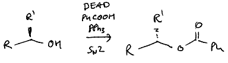
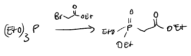

# Namensreaktionen
Im Folgenden wird ein Überblick über die wichtigsten Namensreaktionen für die erste Zwischenklausur gegeben. Zunächst wird betrachtet, welche "Aktion" die jeweiligen Reaktionen ausüben (Deoxygenierung, Addition, etc.), um dann im Detail die Mechanismen in der Kürze zu betrachten.

## Radikalische Namensreaktionen
### "Aktionen" der Reaktionen
 - **Wohl-Ziegler Bromierung**: Radikalische Bromierung unter Minimierung der elektrophilen Addition
 - **Entfernung funktioneller Gruppen  mit Bu3SnH**
 - **Barton McCombie Deoxygenierung**: Deoxygenierung
 - **Barton McCombie Decarboxylierung**: Decarboxylierung
 - **Kolbe Decarboxylierung**: Decarboxylierung
 - **Appel Reaktion**: Entfernung einer Hydroxygruppe

### Reaktionen aufgeteilt nach Typen
 - Halogenierung:
    - Allyl-Alken: Wohl-Ziegler Bromierung
    - Alkohol: Appel-Reaktion (Chlorierung)
 - Entfernung funktioneller Gruppen
    - Halogene: Bu3SnH
    - Alkohole: Barton-McCombie Deoxygenierung
    - Carboxygruppen: Barton-McCombie Decarboxylierung

### Wohl-Ziegler Bromierung

/// caption
Quelle: https://de-academic.com/pictures/dewiki/53/500px-wohl-ziegler.svg.png
///

### Entfernung funktioneller Gruppen  mit Bu3SnH

/// caption
Quelle: https://lightcat-files.s3.amazonaws.com/problem_images/4e556f8dba20cd67-1714431677784.jpg
///

### Barton-McCombie Deoxygenierung
Sehr ähnlich zu der [Tschugajew Eliminierung](/chemistry/Organic%20Chemistry/OC%20Reaktionsmechanismen/Zwischenklausur%20I/Namensreaktionen/#tschugajew), bei der statt radikalisch mit Hitze syn-eliminiert wird.

{: style="height:70%;width:70%"}
/// caption
Quelle: https://nrochemistry.com/barton-mccombie-reaction/
///

### Barton-McCombie Decarboxylierung

#### Mechanismus
Anmerkung: Der Mechanismus wird hier am Säurehalogenid gezeigt, da die Reaktion so schneller ablaufen wird (stärkeres positiv-polarisierte Kohlenstoffatom). Die Reaktion funktioniert ebenfalls an Carboxygruppen.

{: style="height:90%;width:90%"}

/// caption
Quelle: https://de.wikipedia.org/wiki/Barton-Decarboxylierung
///

### Kolbe-Decarboxylierung
{: style="height:60%;width:60%"}
/// caption
Quelle: https://sdfestaticassets-eu-west-1.sciencedirectassets.com/shared-assets/103/topics/reaxys/rf_431/m_rf_431.svg
///

## Nucleophile Substitutionsreaktionen
### "Aktionen" der Reaktionen
 - Tosylierung: Aktivierung - Fluchtgruppe
 - Finkelstein: Umhalogenierung
 - Appel: Substitution: Alkohol -> Halogen
 - Mitsunobu: Umkehrung der Stereokonfiguration von Alkoholen
 - Gabriel: Substitution: Alkylhalogenid -> Amin
 - Williamson-Ether Synthese: Alkoxid + Alkylhalogenid -> Ether
 - Michaelis-Arbuzov: Triphosphorester + Alkylhalogenid -> 

### Reaktionen aufgeteilt nach Typen
 - Aktivierung
    - Tosylierung
 - Halogenierung: 
    - Finkelstein (Umhalogenierung)
    - Appel
 - Stereokonfiguration: Mitsunobu
 - Ether: Williamson
 - Phosphorylsynthese: Michaelis-Arbusov

### Tosylierung - p-Toluolsulfonsäuregruppe
{: style="height:75%;width:75%"}
/// caption
Quelle: https://www.chemistrysteps.com/wp-content/uploads/2020/01/Converting-Alcohols-to-Tosylates-the-Mechanism.png
///

### Finkelstein-Reaktion

/// caption
Quelle: https://de.m.wikipedia.org/wiki/Datei:Finkelstein_reaction_mechanism_V1.svg
///

Aceton wird hier als Lösungsmittel verwendet, da das entstehende Natriumchlorid sich nicht in diesem löst (aber die meisten organischen Substanzen sowie Natriumiodid schon).

### Appel-Reaktion

/// caption
Quelle: https://upload.wikimedia.org/wikipedia/commons/thumb/2/22/Appel-Reaktion_M-v3.svg/1920px-Appel-Reaktion_M-v3.svg.png
///

### Mitsunobu-Reaktion

/// caption
Quelle: https://www.name-reaction.com/mitsunobu-reaction
///

In der Vorlesung wurde die Benzoesäure genutzt, um das Stickstoff nach der Reaktion von dem DEAD (DiEthylAzoDicarboxylat) mit dem TPP (TriPhenylPhosphit) zu protonieren.

/// caption
Quelle: Vorlesungsfolien
///

### Gabriel Reaktion

/// caption
Quelle: https://de.wikipedia.org/wiki/Gabriel-Synthese
///

### Williamson-Ether Synthese

/// caption
Quelle: https://www.name-reaction.com/williamson-ether-synthesis
///

In der Vorlesung wurde folgende Reaktion vorgestellt. Dabei dient Kaliumcarbonat als Base, um das Alkoxid zu erzeugen.

/// caption
Quelle: Vorlesungsfolien
///

### Michaelis-Arbusov

/// caption
Quelle: https://en.wikipedia.org/wiki/Michaelis%E2%80%93Arbuzov_reaction
///

/// caption
Quelle: Vorlesungsfolien
///

## Eliminierungsreaktionen
### Reaktionen aufgeteilt nach Typen
 - syn-Eliminierung: Cope
 - Dehydratisierung: Tschugajew

### Cope Eliminierung

/// caption
Quelle: https://www.chemistrysteps.com/wp-content/uploads/2021/12/Cope-elimination-mechanism.png
///

### Tschugajew
Sehr ähnlich zu der [Barton-McCombie Deoxygenierung](/chemistry/Organic%20Chemistry/OC%20Reaktionsmechanismen/Zwischenklausur%20I/Namensreaktionen/#barton-mccombie-deoxygenierung), bei der statt Hitze radikalisch vorgegangen wird.

/// caption
Quelle: https://de.wikipedia.org/wiki/Tschugajew-Reaktion
///

## Additionen
### "Aktion" der Reaktion
 - Ungesättigte Carbonsäure + Iod + Base -> Iodlacton: Iodlactonisierung
 - Alken + Persäure -> Epoxid: Prileschajew

### Reaktionen aufgeteilt nach Typen
 - syn-Addition
    - syn-Hydroxylierung: Upjohn-Bishydroxylierung
    - syn-Addition, anti-Markovnikov: Hydroborierung
 - anti-Addition, Markovnikov-Produkt: elektrophile Addition
 - Epoxid-Synthese: Prileschajew
 - Lactonisierung: Iodlactonisierung
 - Ringbildung:
    - Phenol-Ring: Diels-Alder
    - Triazol-Ring: Click Reaktion

### Iodlactonisierung

/// caption
Quelle: https://link.springer.com/chapter/10.1007/978-3-662-46180-8_6
///

### Prileschajew

/// caption
Quelle: https://de.wikipedia.org/wiki/Prileschajew-Reaktion
///

### Upjohn-Bishydroxylierung

/// caption
Quelle: https://www.organic-chemistry.org/namedreactions/upjohn-dihydroxylation.shtm
///

/// caption
Quelle: Vorlesungsfolien
///

### Hydroborierung

/// caption
Quelle: Vorlesungsfolien
///

/// caption
Quelle: https://de.m.wikipedia.org/wiki/Benutzer:Werderkli/Spielwiese/Hydroborierung
///

### Click Reaktion

/// caption
Quelle: Vorlesungsfolien
///

